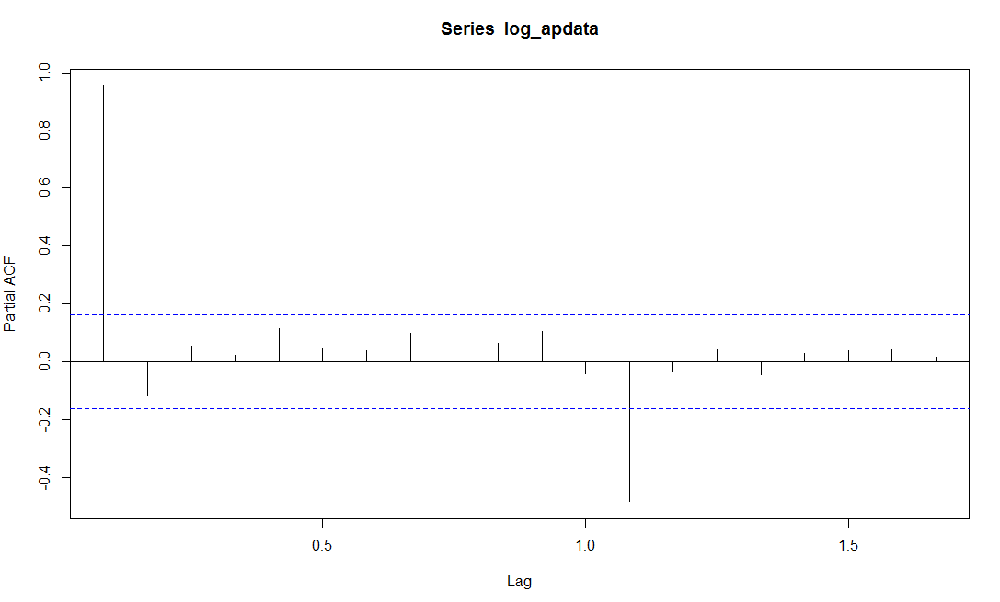
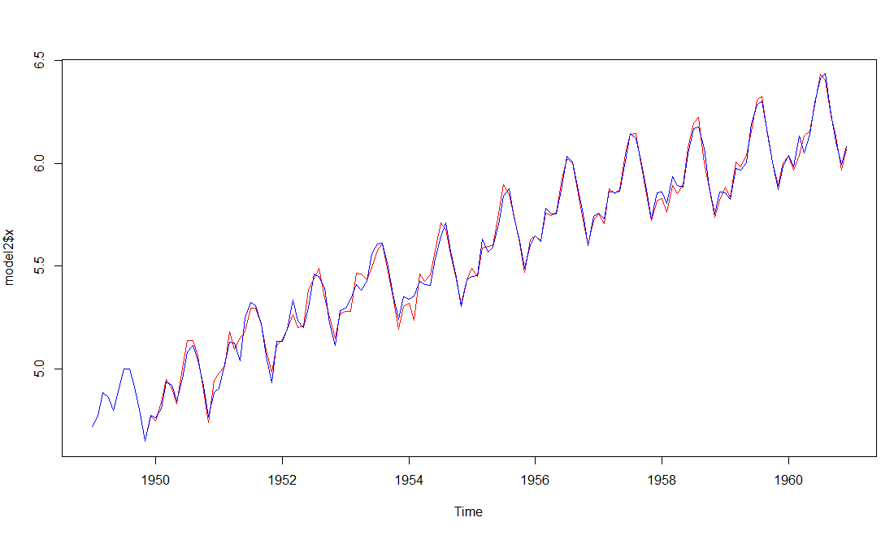

### Setting the working directory

```
setwd("D:\\Data Scince\\8. Case studies\\5. Oct 2017 - Time series\\r code\\time series case rework")
```
### Importing libraries

```
library(dplyr)
library(xts)
library(XML)
library(forecast)
library(tseries)
```
### Reading the data set 

```
rawdata <- scan("rawdata.txt")
```
### Converting the data to timeseries data

```
apdata <- ts(rawdata,frequency = 12,start = c(1949,1))
str(apdata)
```

### Plot the time series


```
plot_ts <-plot.ts(apdata)
```

#### Line of Fit


```
plot(apdata)
abline(reg=lm(apdata~time(apdata)))
```
### Plotting the trend line and the seasonal effect


```
plot(aggregate(apdata,FUN = mean))
```


```
boxplot(apdata~cycle(apdata))
```

*We see a increasing trend
Also the mean increasing the month of July and August indicating a seasonal effect.* 

**We see that the time series has the following**
    1. an increasing trend.
    2. A seasonal component
    3. Unequal variance which increases with time
    Hence the series is not stationary and needs to be transformed. 
    The variance and seasonal component can be handled with a log transformation.
    Difference will help in handling the trend component

**Since the data is not additive, it multiplicative. Hence we we need to transform it.**

### Applying a log transformation on the timeseries
```
log_apdata <-log(apdata)

plot_logts <-plot.ts(log_apdata)
```
_We see that the variation in the plot has reduced after the log transformation_

### Decomposing the time series

```
decom_logts <-decompose(log_apdata)
plot_decom_logts <- plot(decom_logts)
```
_We see that the time series is additive, there is an increasing trend, along with the seasonality component_

### ACF and PCF

##### 1. Before differencing the data.
**ACF & PACF for the log transformed data series**
```
apdata_acf <- acf(log_apdata, lag.max = 20)
```

_We see that the lag are auto correlated and they drop gradaully indicating it is non stationary time series_
```
apdata_pacf <- pacf(log_apdata, lag.max = 20)
```

_We see that the lag at the 9 and 12 peroid cross the blue line indicating they are significantly different from zero and not stationary_

#### 2.ACF and PACF with single period difference 
```
log_ap_diff1 <- diff(log_apdata,1)
```

```
plot(log_ap_diff1)
```
_With a single period differnece we were able to stablize the trend component of the series._
##### ACF with single period differencing
```
ap_diff1_acf <- acf(log_ap_diff1, lag.max = 36)
```

_We see that the lag at 1,4,8,11,12,13,16,20,23,24,25 and so on are significant, indicating that we need to difference the data further_
##### PACF with single period differencing
```
ap_diff1_pacf <- pacf(log_ap_diff1, lag.max = 36)
```

_We see that the lag till 13 period are significant and there after tapering of to zero. However we still need to difference it as the series is not stationary._

#### 3. ACF and PACF with single period differencing and seasonal span of 12 months.
**Since the data is collected at 12 months cycle, we diff it at lag-12**
```
log_ap_diff1_12 <- diff(log_ap_diff1,lag = 12)
plot(log_ap_diff1_12)
```


##### ACF with single period differencing and seasonal span of 12 months.
```
ap_diff1_12_acf <- acf(log_ap_diff1_12, lag.max = 36)
ap_diff1_12_acf <- acf(log_ap_diff1_12, lag.max = 36,plot = FALSE)
```

_Here we see significant lag at 1 and 12 and marginal lag at 3, which then tapers off to zero. We can also conclude that the series is stationary now and can be used to deterime the values of the ARIMA model._
##### PACF with single period differencing and seasonal span of 12 months.
```
ap_diff1_12_pacf <- pacf(log_ap_diff1_12, lag.max = 36, plot = FALSE)
```

_We see significant lag at 1,3,9 and 12 period. We need to note that when the lag appears at unusual lag peroid, we can ignore it._

#### Determining the ARIMA Model to fit the data.
The details explaination about building the model has been provided in the [presentation]()

#### ARIMA model as determined
```
model1 <- Arima(log_apdata,order = c(0,1,1), seasonal = list(order=c(0,1,1),period=12))
```
#### Plot fitted model with the original series.

```
plot(model1$x,col="red")
lines(fitted(model1),col="blue")
```
#### Auto arima using the original data
```
auto_arima_apdata <- auto.arima(apdata)
```
#### Auto arima using the log transformed data
```
auto_arima_logap <- auto.arima(log_apdata)
```
### Predict the demand for next 12 months with confidence level of 80%

_The above plot provides the prediction on the logged series. Hence we need to use exp function to get back the orignal series to predict the no. of passengers._
```
forecast_model <-forecast(model1,h=12,level = c(80.0))
plot(forecast_model,xlab = "Year", ylab='No.of passengers', main= "Forecasting demand for the next 12 months")
```
### Using exp function to convert the log estimates to no. of passengers
```
forecast_model_exp <-forecast_model
forecast_model_exp$mean <- exp(forecast_model_exp$mean)
forecast_model_exp$lower <- exp(forecast_model_exp$lower)
forecast_model_exp$upper <- exp(forecast_model_exp$upper)
forecast_model_exp$x <- exp(forecast_model_exp$x)
```

```
plot(forecast_model_exp)
```

### Predicting demand for next 12 months along with a 3 way estimate using a 95% confidence interval (2 times std deviation)
- Realistic - as predicted by the model (predicted value)
- Optimistic - predicted value + 2 times std deviation
- Pessimistic - predicted value + 2 times std deviation

_Note - Here we assume that all variation is due to random error. hence the standard deviation is calculated using the error component of the series._
##### Predicting the values
```
pred_values <- predict(model1, n.ahead = 12)
```

```
plot2 <- plot(apdata, type ='l', xlim=c(1949,1962), ylim=c(0,800), xlab = "Year", ylab='No.of passengers', main= "Forecasting demand for the next 12 months")
lines(exp(pred_values$pred),col='blue')
lines(exp(pred_values$pred+2*pred_values$se),col='orange')
lines(exp(pred_values$pred-2*pred_values$se),col='orange')
pred_values$realistic <- exp(pred_values$pred)
pred_values$optimistic <- exp(pred_values$pred+2*pred_values$se)
pred_values$pessimistic <-exp(pred_values$pred-2*pred_values$se)
forecast_values <- as.data.frame(pred_values)
write.csv(forecast_values,"forecast_values.csv")
```
### Measuring the performance of the model
#### Check the correlation of the residuals

_We see that none of the lines are crossing the crital level. Hence the residuals are not auto correlated but are random distributed indicating that the model is fine._
```
acf_residuals <- acf(forecast_model$residuals,lag.max = 20, main =" ACF Plot for the residuals")
pacf_residuals <- pacf(forecast_model$residuals,lag.max = 20, main =" PACF Plot for the residuals")
```
#### Ljung Box test 
```
box_test_residuals <- Box.test(forecast_model$residuals,lag= 20,type = "Ljung-Box")

```
_Here we see that the pvalue is above 0.05, indicated that the box test statistic is not significant.Further confirming that the residuals are not correlated._

#### Ploting the residuals

```
plot_residuals <- plot.ts(forecast_model$residuals, main = "Plot of the residuals")
abline(a=0, b=0, col='Blue')
mean(forecast_model$residuals)
```
_We see that the residuals are distrbuted randomly and roughly we find same number of points above and below the zero line. Also the mean of the residuals work out to about 0.0005_

### Histogram of the residuals

_We see that the residuals are normally distributed with equal numbers of points on the either side of zero._
```
hist_residuals <- hist(forecast_model$residuals, main = "Histogram of the residuals",xlabs = "Residuals",col ="blue")
normal_dist <- rnorm(forecast_model$residuals,mean(forecast_model$residuals),sd(forecast_model$residuals))
lines(density(normal_dist,adjust=2),col="red")
```


